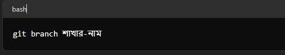
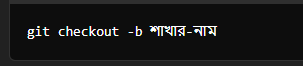
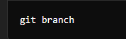
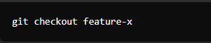
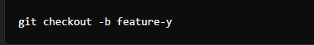
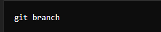

## Git-এ branch হলো একটি আলাদা লাইন বা শাখা যেখানে আপনি আপনার কোডের পরিবর্তনগুলি আলাদাভাবে কাজ করতে পারেন। এর মাধ্যমে আপনি মূল বা প্রধান কোড থেকে বিচ্ছিন্নভাবে কাজ করতে পারেন এবং পরে এই পরিবর্তনগুলি মূল কোডে যোগ করতে পারেন।

### মূল নির্দেশনাগুলি:

1.নতুন শাখা তৈরি করা:

**এই কমান্ডটি আপনার বর্তমান শাখার থেকে একটি নতুন শাখা তৈরি করবে।**

2.শাখা পরিবর্তন করা (Checkout):

**এই কমান্ডটি আপনাকে নির্দিষ্ট শাখায় নিয়ে যাবে।**

3.নতুন শাখা তৈরি এবং সেই শাখায় পরিবর্তন করা:

**এই কমান্ডটি একটি নতুন শাখা তৈরি করে এবং সাথে সাথে সেই শাখায় পরিবর্তন করে।**

4.শাখাগুলির তালিকা দেখানো:

**এই কমান্ডটি আপনার রিপোজিটরির সকল শাখার তালিকা দেখাবে।**

5.শাখা মুছে ফেলা:

**এই কমান্ডটি একটি শাখা মুছে ফেলবে। তবে, শাখাটি মুছে ফেলার আগে নিশ্চিত হয়ে নিন যে আপনার পরিবর্তনগুলি অন্যান্য শাখায় মার্জ হয়েছে।**

## উদাহরণ:

1.নতুন শাখা তৈরি করা:

2.শাখা পরিবর্তন করা:

3.নতুন শাখা তৈরি এবং পরিবর্তন করা:

4.শাখাগুলির তালিকা দেখা:

5.শাখা মুছে ফেলা:

