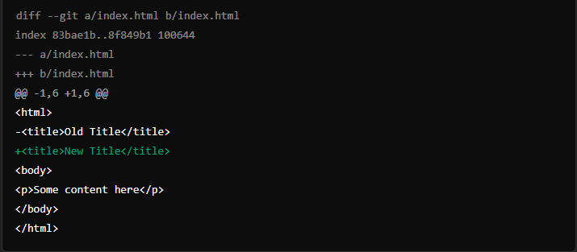

# git diff কমান্ডটি গিট রিপোজিটরিতে কোন ফাইলগুলোতে কি কি পরিবর্তন হয়েছে তা দেখায়। এটি মূলত দুটি সংস্করণের মধ্যে পার্থক্য (ডিফারেন্স) প্রদর্শন করে। নিচে git diff কমান্ডের কিছু সাধারণ ব্যাখ্যা বাংলায় দেওয়া হলো:

### মূল কমান্ড: git diff

**এটি বর্তমান কর্মপরিসরের (working directory) সাথে সর্বশেষ কমিটের (last commit) মধ্যে কি কি পরিবর্তন হয়েছে তা দেখায়।**

**উদাহরণ:**

`git diff`

### নির্দিষ্ট ফাইলের পরিবর্তন দেখতে: git diff <filename>

**একটি নির্দিষ্ট ফাইলের পরিবর্তন দেখতে ব্যবহার করা হয়।**

**উদাহরণ:**

`git diff index.html`

## স্টেজিং এরিয়ার সাথে পরিবর্তন দেখতে: git diff --staged

**স্টেজিং এরিয়ার (যেখানে git add দিয়ে ফাইলগুলো যোগ করা হয়) সাথে বর্তমান কমিটের মধ্যে পরিবর্তন দেখানোর জন্য ব্যবহার করা হয়।**

**উদাহরণ:**

`git diff --staged`

## দুটি নির্দিষ্ট কমিটের মধ্যে পার্থক্য দেখতে: git diff <commit1> <commit2>

**দুটি নির্দিষ্ট কমিটের মধ্যে পার্থক্য দেখতে এই কমান্ডটি ব্যবহার করা হয়।**

`git diff abc1234 def5678`

## আউটপুট ব্যাখ্যা:

**git diff কমান্ডের আউটপুট সাধারণত নিচের মত হয়:**

**এখানে:**

**--- এবং +++ লাইনগুলো ফাইলের পুরনো এবং নতুন সংস্করণ নির্দেশ করে।**

---

- চিহ্নিত লাইনগুলো মুছে ফেলা হয়েছে।

* চিহ্নিত লাইনগুলো যোগ করা হয়েছে।

**Note: এইভাবে git diff কমান্ডটি ব্যবহার করে আপনি গিট রিপোজিটরির পরিবর্তনগুলো ট্র্যাক করতে পারেন।**
