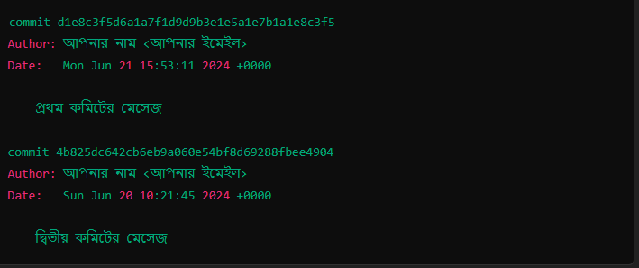

## git log কমান্ডটি গিট রিপোজিটরির হিস্টোরি দেখার জন্য ব্যবহৃত হয়। এটি আপনার কোডে করা সমস্ত কমিটের একটি তালিকা প্রদর্শন করে। কমান্ডটি রান করলে, আপনি প্রতিটি কমিটের জন্য নির্দিষ্ট কিছু তথ্য পাবেন। নিচে git log কমান্ডটির একটি উদাহরণ এবং তার ব্যাখ্যা দেওয়া হলো:

`git log`

এই কমান্ডটি রান করলে নিচের মতো আউটপুট আসতে পারে:

**প্রত্যেকটি কমিটের জন্য নিচের তথ্যগুলো পাওয়া যাবে:**

1.Commit Hash: প্রতিটি কমিটের জন্য একটি ইউনিক আইডি থাকে, যেমন d1e8c3f5d6a1a7f1d9d9b3e1e5a1e7b1a1e8c3f5। এটি প্রতিটি কমিটকে ইউনিক করে তোলে।

2.Author: কমিটটি কে করেছেন তার নাম এবং ইমেইল ঠিকানা দেখায়, যেমন আপনার নাম <আপনার ইমেইল>।

3.Date: কমিটটি কবে করা হয়েছে তা দেখায়, যেমন Mon Jun 21 15:53:11 2024 +0000।

4.Commit Message: কমিটের সাথে দেওয়া বার্তা, যা কমিটটি কেন করা হয়েছে তার একটি সংক্ষিপ্ত বিবরণ দেয়, যেমন প্রথম কমিটের মেসেজ।

**এই তথ্যগুলি ব্যবহার করে, আপনি আপনার কোডের হিস্টোরি বুঝতে পারবেন এবং কোন সময়ে কী পরিবর্তন হয়েছে তা ট্র্যাক করতে পারবেন।**

### আপনি git log কমান্ডটি বিভিন্ন অপশন সহ ব্যবহার করতে পারেন। কিছু সাধারণ অপশনগুলো হল:

- git log --oneline: প্রতিটি কমিটকে এক লাইনে দেখায়।

- git log --graph: কমিটগুলোর মধ্যে সম্পর্ক একটি গ্রাফের মাধ্যমে দেখায়।

- git log --author="Author Name": নির্দিষ্ট লেখকের কমিটগুলো দেখায়।

- git log --since="2024-06-01": নির্দিষ্ট তারিখের পরে করা কমিটগুলো দেখায়।

**এই অপশনগুলো ব্যবহার করে আপনি git log আউটপুটকে কাস্টমাইজ করতে পারেন যাতে আপনার প্রয়োজন অনুযায়ী তা সহজে পড়া যায়।**
