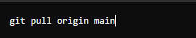

## Git pull কমান্ডটি ব্যবহার করা হয় রিমোট রিপোজিটরি থেকে লোকাল রিপোজিটরিতে আপডেট আনতে। এটি রিমোট রিপোজিটরির সর্বশেষ পরিবর্তনগুলি লোকাল রিপোজিটরিতে মেয়ার্জ করে।

### git pull কমান্ডের ব্যাখ্যা:

1.প্রথমে রিমোট রিপোজিটরিতে সংযোগ স্থাপন করুন:

এখানে,

- origin: রিমোট রিপোজিটরির নাম (ডিফল্টভাবে এটি origin হয়)

- main: ব্রাঞ্চের নাম (ডিফল্ট ব্রাঞ্চের নাম main হতে পারে, এটি masterও হতে পারে)

  2.ফেচ এবং মেয়ার্জ:

- git fetch: এটি রিমোট রিপোজিটরির আপডেটগুলো লোকাল রিপোজিটরিতে নিয়ে আসে কিন্তু কোনো মেয়ার্জ করে না।
- git merge: এটি লোকাল রিপোজিটরির বর্তমান ব্রাঞ্চে রিমোট রিপোজিটরির আপডেটগুলো মেয়ার্জ করে।

**git pull কমান্ডটি git fetch এবং git merge কমান্ড দুটিকে একসাথে সম্পন্ন করে।**

## উদাহরণ:

এই কমান্ডটি আপনার লোকাল রিপোজিটরিতে origin রিমোট রিপোজিটরির main ব্রাঞ্চ থেকে সর্বশেষ পরিবর্তনগুলি নিয়ে আসবে এবং আপনার লোকাল ব্রাঞ্চের সাথে মেয়ার্জ করবে।

সম্ভাব্য সমস্যাগুলো:
1.মেয়ার্জ কনফ্লিক্ট: যদি একই ফাইলের একই লাইনে রিমোট এবং লোকাল রিপোজিটরিতে পরিবর্তন থাকে, তবে মেয়ার্জ কনফ্লিক্ট হতে পারে। এই ক্ষেত্রে আপনাকে কনফ্লিক্ট ম্যানুয়ালি সমাধান করতে হবে।

2.ফাস্ট-ফরওয়ার্ড মেয়ার্জ: যদি লোকাল ব্রাঞ্চের কোনো পরিবর্তন না থাকে, তবে এটি একটি ফাস্ট-ফরওয়ার্ড মেয়ার্জ হবে, অর্থাৎ, লোকাল ব্রাঞ্চ সরাসরি রিমোট ব্রাঞ্চের অবস্থানে চলে যাবে।
