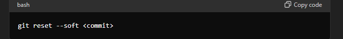

## git reset একটি কমান্ড যা গিট রিপোজিটরিতে বিভিন্ন অবস্থায় ব্যবহৃত হয়। এটি মূলত আপনার হেড, ইনডেক্স (স্টেজিং এরিয়া) এবং আপনার ওয়ার্কিং ডিরেক্টরির অবস্থা পরিবর্তন করতে ব্যবহৃত হয়।

## git reset এর প্রকারভেদ

### git reset কমান্ডের তিনটি প্রধান মোড আছে:

---

1.--soft:

- শুধুমাত্র HEAD (বর্তমান শাখার টিপ) পরিবর্তন করে।
- স্টেজিং এরিয়া এবং ওয়ার্কিং ডিরেক্টরিতে কোন পরিবর্তন আনে না।

### উদাহরণস্বরূপ:

**এটি ব্যবহার করলে আপনি পূর্বের কমিট গুলো আবার স্টেজ করতে পারবেন।**

2.--mixed (ডিফল্ট):

- HEAD এবং স্টেজিং এরিয়া উভয়কেই পরিবর্তন করে, কিন্তু ওয়ার্কিং ডিরেক্টরির ফাইলগুলো অপরিবর্তিত থাকে।

### উদাহরণস্বরূপ:

**এটি ব্যবহার করলে পরিবর্তনগুলো স্টেজিং এরিয়া থেকে সরিয়ে দেয়, কিন্তু ওয়ার্কিং ডিরেক্টরিতে ফাইলগুলো অপরিবর্তিত থাকে।**

3.--hard:

- HEAD, স্টেজিং এরিয়া এবং ওয়ার্কিং ডিরেক্টরি উভয়কেই পরিবর্তন করে।

### উদাহরণস্বরূপ:

**এটি ব্যবহার করলে সব পরিবর্তন হারিয়ে যাবে এবং আপনার কাজ পুরোনো কমিটে ফিরে যাবে।**

### **উদাহরণ:**

1.git reset --soft HEAD~1:

- এটি সর্বশেষ কমিটকে সরিয়ে দেয়, কিন্তু ফাইলগুলো স্টেজিং এরিয়াতে রেখে দেয়।

  2.git reset --mixed HEAD~1:

- এটি সর্বশেষ কমিটকে সরিয়ে দেয় এবং ফাইলগুলো স্টেজিং এরিয়া থেকে সরিয়ে ওয়ার্কিং ডিরেক্টরিতে রেখে দেয়।

  3.git reset --hard HEAD~1:

- এটি সর্বশেষ কমিটকে সরিয়ে দেয় এবং ওয়ার্কিং ডিরেক্টরি পুরোপুরি পূর্বের অবস্থায় নিয়ে যায়, তাই সব পরিবর্তন হারিয়ে যায়।

**সতর্কতা**

- **--hard মোড ব্যবহার করার সময় সতর্ক থাকুন কারণ এটি ওয়ার্কিং ডিরেক্টরির সব পরিবর্তন হারিয়ে ফেলতে পারে যা পুনরুদ্ধার করা যায় না।
  আশা করি এটি আপনার জন্য গিট রিসেট কমান্ডের একটি পরিস্কার ধারণা প্রদান করেছে।**
