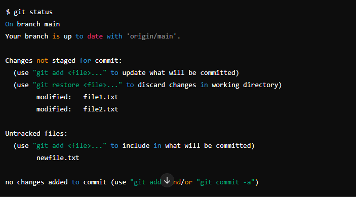

# git status কমান্ডটি গিট রিপোজিটরির বর্তমান অবস্থা দেখার জন্য ব্যবহৃত হয়। এটি রিপোজিটরির ফাইলগুলির অবস্থা সম্পর্কে বিস্তারিত তথ্য প্রদান করে। নিচে git status কমান্ডের ব্যাখ্যা এবং এর আউটপুট সম্পর্কে বিস্তারিত আলোচনা করা হলো:

## **git status কমান্ডের কাজ**

### **git status চালানোর মাধ্যমে আপনি নিম্নলিখিত তথ্য পেতে পারেন**

**1.বর্তমান ব্রাঞ্চের নাম:** কোন ব্রাঞ্চে আপনি কাজ করছেন তা দেখায়।

**2.কমিটের অবস্থা:** রিপোজিটরিতে কমিট করা হয়েছে কিনা বা নতুন কিছু কমিট করতে হবে কিনা তা দেখায়।

**3.স্টেজিং এরিয়া:** কোন ফাইলগুলো স্টেজিং এরিয়ায় আছে, অর্থাৎ পরবর্তী কমিটে অন্তর্ভুক্ত হওয়ার জন্য প্রস্তুত আছে, তা দেখায়।
**4.আনস্টেজড ফাইল:** কোন ফাইলগুলো পরিবর্তিত হয়েছে কিন্তু এখনো স্টেজিং এরিয়ায় যোগ করা হয়নি তা দেখায়।

**5.আনট্র্যাকড ফাইল:** কোন ফাইলগুলো নতুন যোগ করা হয়েছে কিন্তু এখনো ট্র্যাকিং এরিয়ায় যোগ করা হয়নি তা দেখায়।

### উদাহরণ:

---

### এই আউটপুটে:

- On branch main: আপনি বর্তমানে main ব্রাঞ্চে আছেন।
- Your branch is up to date with 'origin/main'.: আপনার লোকাল ব্রাঞ্চটি রিমোট ব্রাঞ্চের সাথে আপডেট আছে।
- Changes not staged for commit: এখানে যেসব ফাইলগুলো পরিবর্তিত হয়েছে কিন্তু স্টেজিং এরিয়ায় যোগ করা হয়নি তা দেখাচ্ছে।
  - modified: file1.txt, modified: file2.txt: এই ফাইলগুলো পরিবর্তিত হয়েছে।
- Untracked files: যেসব ফাইলগুলো নতুন যোগ করা হয়েছে কিন্তু Git এর মাধ্যমে এখনো ট্র্যাক করা হয়নি তা দেখাচ্ছে।

  - newfile.txt: এই ফাইলটি নতুন যোগ করা হয়েছে।

  ***

**এই তথ্যগুলো আপনাকে জানায় যে কোন ফাইলগুলো পরিবর্তিত হয়েছে, কোন ফাইলগুলো স্টেজিং এরিয়ায় যোগ করা দরকার এবং কোন ফাইলগুলো নতুন যোগ করা হয়েছে। এভাবে, git status কমান্ডটি ব্যবহার করে আপনি সহজেই আপনার রিপোজিটরির বর্তমান অবস্থা সম্পর্কে **জানতে পারেন।
