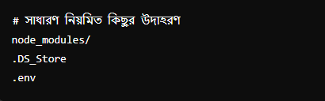

## .gitignore ফাইলটি গিট (Git) ব্যবহারকারীদের জন্য খুবই গুরুত্বপূর্ণ একটি ফাইল। এটি গিট রিপোজিটরিতে কোন ফাইল বা ডিরেক্টরি অন্তর্ভুক্ত করা হবে না তা নির্দেশ করে। সহজ ভাষায় বলতে গেলে, .gitignore ফাইলটি এমন ফাইল বা ফোল্ডার গুলোকে ইগনোর করতে বলে যেগুলো আমরা গিট রিপোজিটরিতে অন্তর্ভুক্ত করতে চাই না।

### .gitignore ফাইলের উদাহরণ:

ব্যাখ্যা:

1.node_modules/: সাধারণত নোড প্রজেক্টে ব্যবহৃত ডিপেন্ডেন্সি প্যাকেজ গুলো এই ফোল্ডারে থাকে। এগুলো রিপোজিটরিতে অন্তর্ভুক্ত করার প্রয়োজন হয় না কারণ যে কেউ প্রজেক্টটি ক্লোন করলে এটি পুনরায় ইনস্টল করতে পারবে।

2.DS_Store: ম্যাক অপারেটিং সিস্টেমে তৈরি হওয়া একটি লুকানো ফাইল, যা প্রতিটি ডিরেক্টরির মেটাডেটা সংরক্ষণ করে। এটি রিপোজিটরিতে অন্তর্ভুক্ত করার প্রয়োজন নেই।

3.env: পরিবেশগত ভেরিয়েবল গুলো সংরক্ষণ করতে ব্যবহৃত হয়। এটি সাধারণত সংবেদনশীল তথ্য যেমন এপিআই কি, ডাটাবেস ইউজারনেম ও পাসওয়ার্ড থাকে। তাই এটি রিপোজিটরিতে অন্তর্ভুক্ত করা উচিত নয়।

### .gitignore ফাইল তৈরি করার উপায়:

1.ফাইল তৈরি করুন: আপনার প্রজেক্টের মূল ডিরেক্টরিতে .gitignore নামে একটি নতুন ফাইল তৈরি করুন।

2.নিয়ম যোগ করুন: আপনি কোন ফাইল বা ডিরেক্টরি গুলো ইগনোর করতে চান, তা এই ফাইলে লিখুন।
